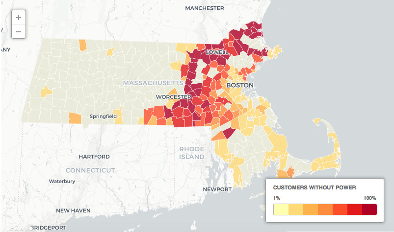

<h1>Massachusetts power outage map</h1>

This python script uses power outage data reported to the Massachusetts Emergency Management Agency by National Grid, Unitil and Eversource to update a live map of outages across the state. MEMA's power outage data is updated every 15 minutes. It is accessible via a public geoJSON file on MEMA's website.

The script is hosted on the Heroku cloud platform, using a scheduler that executes at regular intervals. The map is hosted on [Carto](https://jhaddadin.carto.com/viz/268e8756-11c0-48de-8c04-c360d467bcdd/public_map). It can be embedded by iframe, or generated using [CARTO.js](https://carto.com/docs/carto-engine/carto-js/). This script also feeds the data into a Google Spreadsheet, which can be used to populate a Fusion Table,  Tableau project, etc. See a live example online at [metrowestdailynews.com](https://www.metrowestdailynews.com/news/20180310/live-map-massachusetts-power-outages).  

Before using the script, it's necessary to obtain OAuth2 credentials from Google and save the JSON file containing your credentials into the same folder as the script. The code also requires a Carto API key stored in a text file.
